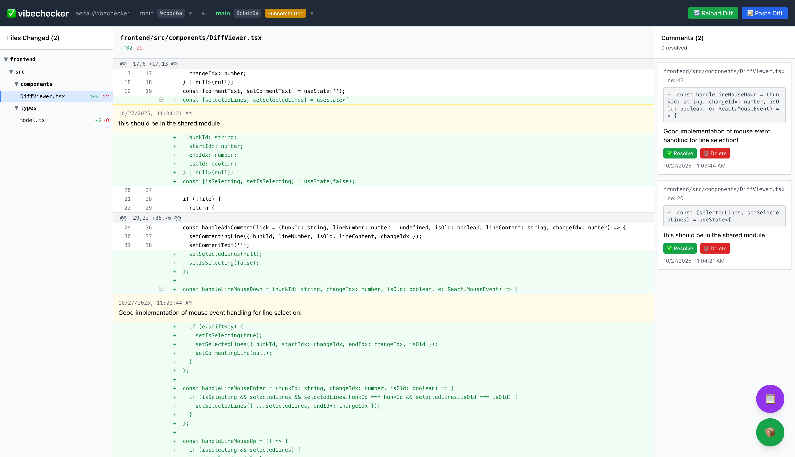

<div align="center">

# ✅ vibechecker

### Local code review made simple - review diffs with inline comments



</div>

## Features

- 📝 **Interactive Diff Review**: Visual diff viewer with syntax highlighting
- 💬 **Inline Comments**: Add comments directly on specific lines
- 🌳 **File Tree View**: Navigate changes in a hierarchical folder structure
- 📋 **Export to Markdown**: Copy all comments with context to clipboard
- 📦 **Export to JSON**: Save review data for later
- 🔄 **Git Integration**: Auto-load diffs from current branch
- 🌲 **Worktree Support**: Switch between different git worktrees
- 💾 **Auto-save**: Your review is automatically saved per workspace

## Installation

```bash
npx @seitau/vibechecker
```

Or install globally:

```bash
npm install -g @seitau/vibechecker
vibechecker
```

## Usage

1. **Start vibechecker**:
   ```bash
   npx @seitau/vibechecker
   ```

2. The tool will automatically:
   - Start a local server on port 3001
   - Open your browser at http://localhost:5173
   - Load the diff from your current git branch

3. **Review workflow**:
   - Click on any line in the diff to add a comment
   - Use the file tree on the left to navigate between files
   - Comments are automatically saved to localStorage
   - Export your review using the floating buttons (📋 for Markdown, 📦 for JSON)

## Development

```bash
# Clone the repository
git clone https://github.com/seitau/vibechecker.git
cd vibechecker

# Install dependencies
npm install

# Start development servers
npm run dev
```

## Project Structure

```
vibechecker/
├── frontend/       # React + Vite frontend
├── server/         # Express API server
├── shared/         # Shared TypeScript types
└── bin/            # CLI executable
```

## License

MIT
